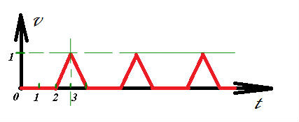
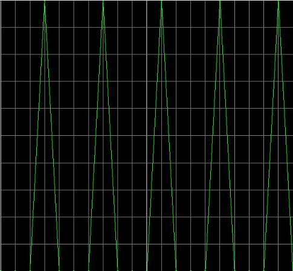

# MSC.MARC 2010表格之创建方式

---

Marc中材料属性、边界条件、接触条件的刚体运动控制部分都会用到表格曲线`Table`。一个表格最多有4个自变量（v1,v2,v3,v4），自变量类型主要有时间、温度、等效应变、坐标等，可以满足绝大部分需求。因此，Table的灵活运用可以满足各种特定工况模拟的需要。

本文是Msc.marc 2010表格介绍的第一部分——创建方法，通常有两种创建表格曲线的方式：

* `DATA POINTS`方式——直接输入数据点的坐标，当数据量较大时可以通过`READ`命令导入
* `FORMULA`方式——通过曲线方程建立曲线

本文着重介绍使用`FORMULA`方式创建表格的一些知识点[^1]。

## 常量

符号|含义| 
---|---|
pi| π | 
e | exponent | 
tz| offset temperature entered via the PARAMETERS model definition option | 
q | Activation energy entered via MATERIAL DATA model definition option | 
r | Universal gas constant entered via the PARAMETERS model definition option | 
sb| Stefan Boltzman constant entered via the PARAMETERS model definition option | 

!!! note
    `v1`,`v2`,`v3`,`v4`分别代表相应的自变量。

## 数学运算符

符号|含义
---|---
+ | addition
- | subtraction
* | multiplication
/ | division
^ | exponential
! | factor
% | mod

## 数学函数

函数名|含义|说明
---|---|---
dcos | cosine (x) | x in radians
dsin | sine (x) | x in radians
dtan | tangent (x) | x in radians
dacos | inverse cosine (x) | f in radians
dasin | inverse sine (x) | f in radians
datan | inverse tangent (x) | f in radians
datan2 | inverse tangent (x,y) | f in radians

函数名|含义|说明
---|---|---
cos | cosine (x) | x in degrees
sin | sine (x) | x in degrees
tan | tangent (x) | x in degrees
acos | inverse cosine (x) | f in degrees
asin | inverse sine (x) | f in degrees
atan | inverse tangent (x) | f in degrees
atan2 | inverse tangent (x,y) | f in degrees

函数名|含义
---|---
cosh | hyperbolic cosine
sinh | hyperbolic sine
tanh | hyperbolic tangent
acosh | inverse hyperbolic cosine
asinh | inverse hyperbolic sine
atanh | inverse hyperbolic tangent

函数名|含义| 
---|---|
log | log based 10 | 
ln | natural log | 
exp | exponent | 
sqrt | square root | 
rad | convert degrees to radians | 
deg | convert radians to degrees | 
abs | obtain absolute value | 
int | truncates the value to whole | 
frac | take the fractional value | 
max | takes the maximal value | 
min | takes the minimal value | 
mod | return the remainder of x, based on y  mod(x,y) = x - y * int (x/y) | 

## 实例说明

假设某刚体运动的速度-时间曲线如下图所示，延续周期数为100。

虽然一个周期内的曲线比较简单，可以直接输入；但是由于周期数太多，手动输入比较麻烦，因此考虑采用函数输入的方式。

该曲线无法用一个初等函数解析表达，但观察发现：一个周期内只有`t=3`这一个点的函数值等于1，因此对于第一个周期的`t=0,1,2,3`可以用`max(v1-2, 0)`实现；其他周期则通过`v1%4`转换到第一周期内，于是表达式为：

    max(v1%4-2,0)

理论上应当实现了，可是在输入过程中发现，Marc自动将`max`转换为`mav1`了，从而导致公式输入错误。这貌似是一个BUG。猜测原因为：公式接受的自变量为`v1`，因此marc默认将可能误输入的字符`x`转换为`v1`。

既然`max()`函数有问题，那就使用`min()`函数按照同样的思路实现即可：

    -min(2-v1%4,0)

[^1]: Marc® 2010 Volume A: Theory and User Information