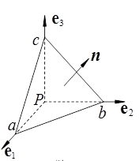

# 应力张量的认识之线性变换

---

这一部分主要是对应力张量数学本质的理解。

## 相似矩阵

通过基础知识我们已经认识到，应力张量代表点的应力状态，它不依赖于坐标系的选取，并且对应着同一主应力状态。用矩阵的观点理解为：__同一点的应力张量矩阵是相似矩阵，并且可以对角化__。

然而问题是为什么会这样？

我们可以这么理解，同一点不同截面下的应力张量描述的都是相同的应力状态，因此他们存在内在联系（例如受约束于静力平衡方程）。由切应力互等定律可知应力张量矩阵是实对称矩阵，而实对称矩阵必定可以对角化，即不同截面应力张量对相似于一个主应力张量；而同一点的主应力状态是确定的。于是由相似矩阵的传递性可知，不同截面下的应力张量矩阵是相似的。

## 线性变换

由应力张量是相似矩阵再进一步，因为 **相似矩阵的本质是同一线性变换在不同基下表示的矩阵**，我们就可以从更根本的角度看待应力张量了： __应力张量代表一个线性变换__！

这是一个抽象的认识，或者说是从相似矩阵推论出来的。那么接下来让他具体化：

从基础知识已经知道，利用三个相互垂直的截面截取一点P，各个截面上的应力分量组成应力张量。以这三个截面的法线方向为正方向建立笛卡尔坐标系，如下图所示。

对于任意法向$\vec{n}=(n_1,\,n_2,\,n_3)$的截面，可以得到截面上的应力分量

$$p_i = \sigma_{ij}\,n_j$$

改写为矩阵表达式

$$A\,x = y$$

其中，

\\[
A = 
\begin{pmatrix}
\sigma_{11} & \tau_{12} & \tau_{13} \\\\\\
\tau_{21} & \sigma_{22} & \sigma_{23} \\\\\\
\tau_{31} & \tau_{32} & \sigma_{33}
\end{pmatrix}\,,
x = n_j = \begin{pmatrix}
n_1 \\\\\\
n_2 \\\\\\
n_3
\end{pmatrix}\,,
y = p_i = \begin{pmatrix}
p_1 \\\\\\
p_2 \\\\\\
p_3
\end{pmatrix}
\\]

根据线性变换与矩阵的一一对应关系可知，应力张量代表一个线性变换（确切的说是线性映射）——**应力张量将截面位置映射到截面应力**。其数学表述为：

$$\sigma\,\in \, Hom(U,\,V),\,\sigma:\,x \rightarrow y \quad x=\left(n_1,\,n_2,\,n_3\right)^T \quad y=\left(p_1,\,p_2,\,p_3\right)^T$$

其中，$U$是截面方向余弦组成的线性空间，$V$是截面应力作成的线性空间。

## 举例说明

以下说明这个线性映射是如何与力学描述相一致的。

之前多次提及，用三个互相垂直的截面截取P点，并以其法向建立笛卡尔坐标系。这样的截面有无数多对，这样的坐标系也有无数多个。为了区分他们，先确定一个`全局坐标系`$S:Oxyz$，那么其他任意的`局部坐标系`$S':O'x'y'z'$就可以用它的坐标轴方向在全局坐标系下的方向余弦来描述了。

例如，局部系$x'$轴在全局坐标系下的方向余弦为

$$\alpha_x = \left(\cos\langle{x',\,x}\rangle,\,\cos\langle{x',\,y}\rangle,\,\cos\langle{x',\,z}\rangle\right)$$

进而，局部坐标系$S'$可以描述为

\\[
\alpha = \left(\alpha_x,\,\alpha_y,\,\alpha_z\right) = 
\begin{pmatrix}
\cos\langle{x',\,x}\rangle & \cos\langle{y',\,x}\rangle & \cos\langle{z',\,x}\rangle \\\\\\
\cos\langle{x',\,y}\rangle & \cos\langle{y',\,y}\rangle & \cos\langle{z',\,y}\rangle \\\\\\
\cos\langle{x',\,z}\rangle & \cos\langle{y',\,z}\rangle & \cos\langle{z',\,z}\rangle
\end{pmatrix}
\\]

在局部坐标系内，截面$\vec{n}$用方向余弦表示为

$$\vec{n}=\left(n_1,\,n_2,\,n_3\right)^T = \left(\cos\langle{\vec{n},\,x'}\rangle,\,\cos\langle{\vec{n},\,y'}\rangle,\,\cos\langle{\vec{n},\,z'}\rangle\right)^T$$

- $\alpha$表示局部坐标系在全局坐标系空间下的基。  
- $\vec{n}$表示任意截面在局部坐标系下的坐标。

局部坐标系任意截面上的应力分布也是类似的情况，其坐标系方向一致，坐标的描述也类似，只是属于不同的空间而已。如此一来，力学描述和数学描述是相互统一的：

- **力学描述**  

    用任意相互垂直的三个平面截取$P$点，以截面法向为正方向建立笛卡尔坐标系，得到三个截面上的应力状态即应力张量$\sigma$。以此为基础，可以求得当前坐标系下任意截面$\vec{n}$上的应力分布$\vec{p}$。 

- **数学描述**  

    任意给定一组基$\alpha$后，可以用坐标$\left(n_1,\,n_2,\,n_3\right)^T$描述截面位置，用坐标$\left(p_1,\,p_2,\,p_3\right)^T$描述截面应力。在这组基下，存在一个线性变换$\sigma$，将截面位置$\vec{n}$映射到截面应力$\vec{p}$。

## 总结

这一部分从相似矩阵及线性变换的角度来认识应力张量，应力张量是从截面位置到截面应力的线性变换所对应的矩阵。