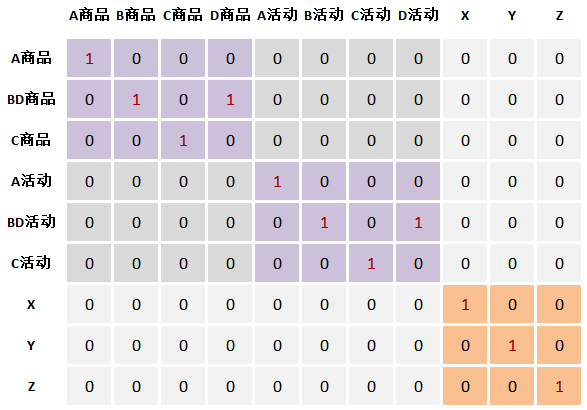

# 程序实现社会核算矩阵（SAM）的账户集结与平衡

---

最近协助一位经济学专业的同学完成了社会核算矩阵（Social Accounting Matrix）的账户集结与平衡，现记录此过程中的一些要点，以作备忘。

首先使用`0-1矩阵法`集结账户，然后使用`直接交叉熵法`平衡SAM，具体流程为：

* 使用Matlab软件从Excel文件读入原始数据
* 分别左乘和右乘相应的矩阵集结账户
* 输出集结后的SAM数据到Excel文件
* 使用GAMS软件读入上一步输出的SAM数据
* 优化得到平衡后的SAM数据
* 输出到Excel文件

## 问题描述

由于不了解相关专业背景，下面就直接从数学角度进行描述。一个简化版（减少账户数和要素数）的SAM表即一个矩阵的结构如下图所示，我们的需求是：


1. 将账户B和D合并为账户BD

    考虑到B、D商品账户分别对应了B、D活动账户，所以实际上需要合并矩阵中B商品、D商品列为一个BD商品列，同时合并B活动、D活动列为BD活动列。

2. 平衡SAM表

    通过交叉熵定义的模型调整矩阵的元素，使之满足第i行元素之和与第i列元素之和相等。

## 合并矩阵

假设$\alpha$是一个元素为0或1的行向量，则根据矩阵乘法运算规律可知，矩阵$M$左乘$\alpha$的效果为：将矩阵$M$的某些行相加，而这些行恰好是行向量$\alpha$中元素1对应的位置，如下图所示。同理，矩阵$M$右乘元素为0或1的列向量$\beta$，可以将$\beta$中元素1位置对应矩阵$M$的列求和。


因此，得到结论：**左乘0-1行向量可以合并行，右乘0-1列向量可以合并列**。

于是，将合并不同行的行向量$(\alpha_1, \alpha_2, \cdots)$组合为矩阵$A$；由于需要合并的列与行是相对应的，所以右乘的合并矩阵即为$A$的转置矩阵$A^T$。最终，合并后的矩阵$N=A\,M\,A^T$。

根据以上推理，本例的合并矩阵$A$如下图所示：




例如，第一行的行向量只有第1个元素为1，表示提取原矩阵的第一行；第二行的第2,4个元素为1，表示提取原矩阵的第二、四行，即合并B、D商品，其他以此类推。对于本例SAM矩阵行列数较少的情况，可以直接写出合并矩阵A。但是，如果实际情况下行列数非常多（例如实际处理时为94×94），则需要程序自动生成。观察以上示例矩阵，可知其具有如下规律：

* 除了图中紫色、橙色标示出的矩阵块之外，其余元素都为0；
* 两个紫色的矩阵块完全一致，其特点为需要合并位置的元素为1，其余位置元素为0；
* 橙色矩阵块为一个单位矩阵。

所以构造合并矩阵$A$的思路为：生成紫色的矩阵块→扩充为左上角部分矩阵→生成右下角单位矩阵→扩充为完整的合并矩阵。这在Matlab中很容易实现，关键代码如下：

``` matlab
% 读入指定区域的原始数据
data = xlsread(filename,input_sheet,range);
data(isnan(data)) = 0.0;   % 将空值设为0

% 合并规则
col = {1,[2,4],3};         % 表示A、B+D、C

N = length(cell2mat(col)); % 合并前商品/活动数
T = length(col);           % 合并后商品/活动数
M = size(data,1) - 2*N;    % 其他项目数（例如示例的X，Y，Z等）

% 构造紫色矩阵块
sub_a = zeros(T, N);
for i =1:T
    sub_a(i,col{i}) = 1;   % 将合并要求中指定位置的元素设置为1
end

% 扩充为针对商品&amp;活动的矩阵块
sub_a = [sub_a zeros(size(sub_a)); zeros(size(sub_a)) sub_a];

% 组装为总的合并矩阵
A = [sub_a zeros(2*T,M);zeros(M,2*N) eye(M)];

% 合并矩阵
ydata = A*data*A';
```

## 平衡矩阵

平衡SAM表使用的是直接交叉熵法，模型及原理不在此阐述，GAMS求解程序可以参考相关专业的材料，例如《可计算一般均衡模型的基本原理与编程》的第五章《SAM表的平衡》。实际操作中需要注意SAM表的读写，这可以参考GAMS相关文档 [^1]。


### SAM表的读入

对于数据较少的情况，例如本例可以直接以`table`的形式输入；但是，如果数据量很大，则可以直接读入Excel文件，代码如下：


    set  i  "定义项目集合，假设有60个账户"  /data1*data60/ ;
    alias(i,j) ;

    Parameters    sam(i,j)   "核算矩阵"  ;
    * 读入合并后的SAM表，赋值给sam参数
    $libinclude xlimport sam C:\Users\Administrator\GAMS\SAM.xlsx sheet2!A1:BI61


### SAM表的写出

类似地，将平衡后的SAM表数据写出到Excel文件的代码如下：


    * 写Excel文件, Q为平衡调整后的数据
    $LIBInclude Xlexport Q.l C:\Users\Administrator\Desktop\temp\GAMS\SAM.xlsx sheet3!A1:BI61


最后特别注意：

读入的SAM表中必须包含与GAMS程序中的`set`一致的索引（表头），写出Excel文件的工作表中也必须事先存在与SAM表一致的索引。


[^1]: [Customized data interchange links for spreadsheets](http://www.gams.com/help/index.jsp?topic=%2Fgams.doc%2Fuserguides%2Fmccarl%2Findex.html)]