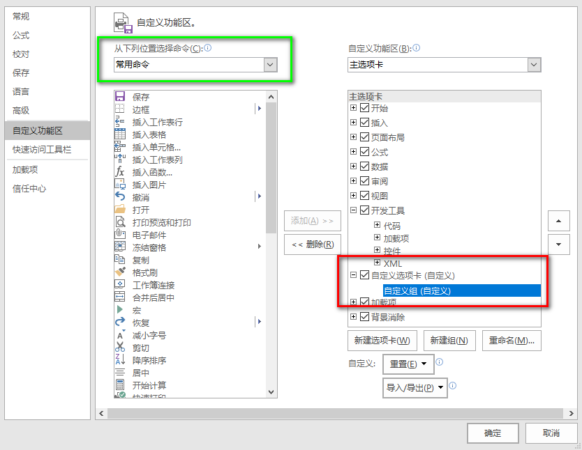

# Microsoft Excel 2010自定义功能区(一)

---

在`Microsoft Excel`中，我们通常借助`VBA`（Visual Basic for Application）将一些通用或者专用的功能定义为过程（Procedure），然后绑定到快捷键、按钮或者自定义菜单上，以方便使用。本文从可移植性的角度，记录自定义`Excel 2010`功能区（Ribbon）菜单的方法。

## 引言

假设自定义的功能是`say Hello World`：

    Sub user_fun()
        MsgBox "Hello world."
    End Sub

我们通常将其保存为启用宏的工作簿（hello_world.xlsm），然后使用快捷键或者绑定按钮事件的方法进行调用：

当我们需要对多个Excel文件都进行`say Hello World`处理时，就需要复制以上VBA代码到每个文件或者将各个文件内容复制到当前的`hello_world.xlsm`工作表中去。也就是说，上述处理方式解决了单个Excel文件的特定问题，但是在可移植性上存在不足。

于是我们希望将`say Hello World`的功能固定到菜单栏，以方便随时对有需要的文件进行处理。这样的方式其实是创建Excel插件（Add-in），对应文件扩展名为`.xlam`。

相对启用宏的`.xlsm`文件，`.xlam`插件分离了数据和代码，用户只需关心数据文件，包含代码的`.xlam`插件则在后台默默地启动（即不具备图形界面）。否则，如果在其他文件中调用`.xlsm`文件中的过程，`.xlsm`文件也会被一并打开，而这对于关心数据处理的用户来说完全没有必要。

于是我们把一开始的代码另存为`hello_world.xlam`。

## 手工创建Ribbon菜单

Excel 2010已经为用户提供了自定义功能区的功能，`文件`->`选项`->`自定义功能区`，通过`新建选项卡`和`新建组`创建自定义的选项卡和分组。

保存后可以看到主选项卡区域出现了自定义的选项卡，当然选项卡下空空如也。接下来为其添加具体的菜单项：在上述对话框中绿色框出区域选择`宏`，然后将相应的宏拖放到刚才新建的分组中即可。当然，此时的宏列表也是空空如也。

双击`hello_world.xlam`打开插件，此时并无额外的窗口出现，但是之前的宏代码已然被默默加载了。重新按前述操作来到`Excel 选项`对话框的`自定义功能区`，此时上述宏列表区域出现了自定义的`user_fun`，将其拖放到我们创建的`自定义组`下，并且可以重命名和选择图标，保存后得到如下完成效果。

此时即便重新打开其他Excel文件，自定义菜单栏始终存在，菜单项的功能依然生效。从上述过程可知，我们需要保证插件`hello_world.xlam`引用位置保持不变，一旦它被移动或者重命名，相应的功能也就查无此人了。所以，一般推荐将其保存到Excel默认的插件目录。

至此，可以愉快地在自己电脑的任意Excel文件上`say hello world`了。然而，如果赵、钱、孙、李也都想`say hello world`，难道每人都需要如此重复一遍？

显然，上述方案的可移植性依然不强，我们希望赵、钱、孙、李收到`hello_world.xlam`文件后，可以自动完成上述过程。于是，这就需要：

[在Excel插件中自动创建Ribbon菜单](2017-07-24-Microsoft-Excel-2010自定义功能区(二).md)